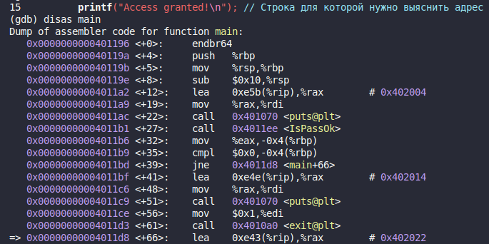
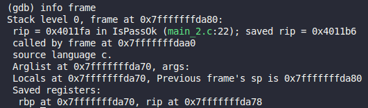
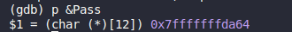

## Введение
Для решения задачи необходимо определить адрес строки `printf("Access granted!\n");`, адрес переменной `Pass` и местонахождение адреса возврата функции `IsPassOk`.
## Определение адреса `Access granted`
Через gdb нужно встать на инструкцию `printf("Access granted!\n");`.
После чего ввести `disas main`. 

Адрес инструкции выделен слева стрелкой:

## Определение адреса возврата и переменной
Для определения адреса возврата нужно находясь в функции `IsPassOk` выполнить команду `info frame`:

Видно, функция сохранила адрес возврата в rip по адресу 0x7fffffffda78, адрес возврата 0x4011b6. Его можно проверить если посмотреть на скриншот выше, этот адрес действительно идет сразу после вызова функции `IsPassOk`.

Адрес переменной определяется при помощи `p &Pass`:

## Рассчет заполнения буфера

Теперь нужно вычислить разницу между двумя адресами внутри функции `IsPassOk`. Между адресом переменной и адресом возврата:

0x7fffffffda64 - 0x7fffffffda78 = -14 (x16) = -20 (x10)

Соответственно, на 20 байт надо произвести переполнение буфера, а следующая информация пойдет в адрес возврата.

Команда для создания файла:

`echo -e "AAAAAAAAAAAAAAAAAAAA\xd8\x11\x40\x00\x00\x00\x00\x00" > input.txt`

Где \xd8\x11\x40\x00 - адрес нужного printf в формате litle-endian.

## Пример работы программы

